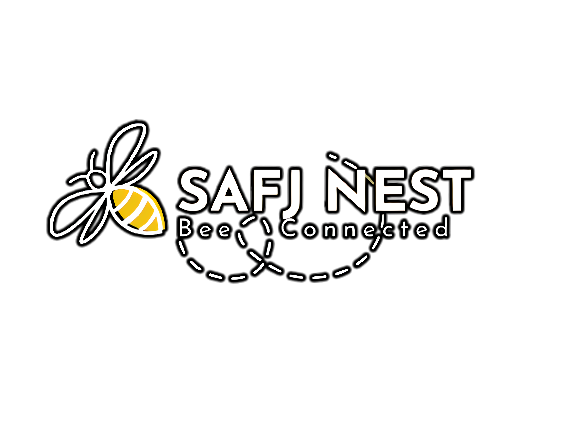

# ***THE BEEBOX***



## ***Panoramica (≧ڡ≦*)***
Semplice bot di Discord che si occupa di fare tutto ciò che gli admin vogliono fargli fare.
Consente di riprodurre canzone, amministara i vari membri e tanto altro ancora ;D.
- Server Discord del BeeBox: https://discord.gg/S2rpYbJ
- Prefix: ***$***
- Versione 1.1
## ***Comandi***

#### ***Non richiedono alcun permesso***
- PING --> Restituisce il ping del bot.
- CONNECT -- > Il bot si collega al canale.
- DISCONNECT --> Il bot si disconnette dal canale.
- PLAY --> [play][link/nome file]| Il bot si connette al canale e riproduce la canzone o il suono richiesto.
- LIST --> Il bot restituisce l'elenco di tutti i suoni presenti nel bot.
- BUGS --> [bugs][nomeCommando][Descrizione bugs]| Il bot invierà ai due dei il messaggio contentente la segnalazione dell'errore.
- MSG --> [msg][idUser][message]| Il bot invierà all'utente desiderato il messaggio richiesto.

#### ***Richiedono permessi speciali***
- CLEAR--> [clear][nMessaggi]| Il bot cancellerà nMessaggi(max 100) nel canale in cui il comando è stato chiamato
- KICK --> [kick][@user/userId]| Il bot espellerrà dal server l'utente desiderato.
- BAN --> [ban][@user/userId]| Il bot bannerrà dal server l'utente desiderato.
- MUTE --> [mute][@user/userId]| Il bot muterà(vocalmente) l'utente desiderato.
- UNMUTE --> [unmute][@user/userId]| Il bot smuterà(vocalmente) l'utente desiderato.
- UNBAN --> [unban][@user/userId]| Il bot sbannerà l'utente desiderato.

#### ***Comandi troll***
- BIGHI --> [bighi][nBits]| Il bot ti restituisce un numero casuale a n bit, se maggiore di 2000 caratteri sarà inviato un file.
- PRIME--> [prime][nBits]| Il bot ti restituisce un numero casuale *primo* a n bit, se maggiore di 2000 caratteri sarà inviato un file.
- DAC--> [dac][numero]| Il bot ti restituisce quante cifre ha il numero richiesto.
- FASTESTROOT--> [fastestroot][numero]| Il bot ti restituisce il risultato della radice inversa del numero richiesto utilizzando la famosa formula della [radice inversa veloce](https://it.wikipedia.org/wiki/Radice_quadrata_inversa_veloce)


## ***Aliases***
- PING --> PONG - PINGPONG
- CONNECT -- > JOIN
- DISCONNECT --> BYE
- PLAY --> P
- LIST --> LISTA
- BUGS --> REPORT - REP
- MSG --> MESSAGGIO - MESSAGE
- CLEAR--> CANCELLA
- KICK --> ESPULSIONE
- BAN --> DESTROY
- UNBAN --> PARDON - SBAN
- MUTE --> //
- UNMUTE --> //
- BIGHI --> RANDOM
- PRIME--> RANDOMPRIME
- DAC--> DIVIDEANDCONQUER
- FASTESTROOT--> RADICEINVERSA - FISQRT

# ***Ulteriori informazioni***
## ***Build with***
- Java version 17
- JDA 5.0.0-Alpha.5
- JDA Chewtils 2.0-SnapShot

## ***Maven***
### ***JDA***
```xml
<repository>
      <id>dv8tion</id>
      <name>m2-dv8tion</name>
      <url>https://m2.dv8tion.net/releases</url>
</repository>
<dependency>
      <groupId>net.dv8tion</groupId>
      <artifactId>JDA</artifactId>
      <version>5.0.0-alpha.5</version>
</dependency>
```
### ***JDA CHEWTILS***
```xml
<repository>
      <id>chew</id>
      <name>m2-chew</name>
      <url>https://m2.chew.pro/snapshots</url>
</repository>
<dependency>
      <groupId>pw.chew</groupId>
      <artifactId>jda-chewtils</artifactId>
      <version>2.0-SNAPSHOT</version>
      <scope>compile</scope>
      <type>pom</type>
</dependency>
```
### ***LAVAPLAYER***
```xml
<dependency>
      <groupId>pw.chew</groupId>
      <artifactId>jda-chewtils</artifactId>
      <version>2.0-SNAPSHOT</version>
      <scope>compile</scope>
      <type>pom</type>
</dependency>
```
## **Bugs da correggere e Features**
***(DD/MM/YY)***
### ***Bugs***
- [x] Connect e Disconnect bugs in caso l'utente non sia in una stanza vocale.
- [x] Play bugs in caso non gli sia dato nessun link o nome del file da cercare.
- [x] Clear bugs in caso di mancato numero di messaggi da eliminare o non ce ne siano
- [ ] Ban,kick e mute bugs nel caso in cui il bot abbia un ruolo inferiore all'utente che sarà bannato,kickato o mutato.
### ***Features***
- [x] Aggiungere la possibilità di riprodurre suoni in locale(.mp3/ .opus) -> 08/02/22
- [x] Aggiungere la possibilità di stampare gli utenti bannati. -> 08/02/22
- [ ] Il comando list fa schifo.
- [ ] Mancano i suoni quindi il comando list fa schifo.
- [ ] Aggiungere i log di sistema.
- [ ] Possibiltà di caricare i suoni tramite comando (Upload).
## **Licenza**
Copyright (c) 22 Giugno anno 0, 2022, SafJNest and/or its affiliates. All rights reserved. SAFJNEST PROPRIETARY/CONFIDENTIAL. Use is subject to license terms.

## ***Contatti***
### Lorenzo Sanseverino 
- Founder
- Developer
- lorenzosanseverino2003@gmail.com
- Git: <a href="https://github.com/NeutronSun">NeutronSun</a> 
- Discord: Sun#7606.
### Panichi Leonardo
- Founder
- Developer
- panichileonardo4@gmail.com
- Git: <a href="https://github.com/Leon412">Leon412</a> 
- Discord: Leon_#7949

