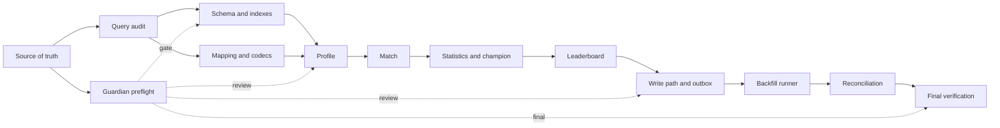

# Strategia agenti per la migrazione Mongo LoL

## Obiettivo

Dividere la migrazione in ownership piccole, verificabili e non sovrapposte. Nessun agente deve convertire tutto `LeagueDB` in una sola passata: l'inventario delle query viene prodotto prima, poi gli implementatori lavorano per capability.

## Regole comuni

Ogni agente deve leggere, nell'ordine:

1. `AGENTS.md`;
2. `docs/architecture/README.md`;
3. ADR-0001, ADR-0003, ADR-0009 e gli ADR della capability;
4. `docs/mongo/README.md`;
5. il documento della fase assegnata;
6. questo file.

Ogni agente:

- modifica solo il proprio perimetro;
- non modifica ADR o piani di altri agenti;
- non crea un secondo owner per un modello, cache o write path;
- riusa i modelli LoL esistenti;
- aggiorna API/documentazione solo se il contratto pubblico cambia;
- si ferma e consegna un conflitto invece di risolverlo implicitamente;
- consegna sempre summary, file modificati, verifiche, rischi e gate.

Il main agent conserva l'orchestrazione e approva ogni passaggio. Il guardian non può approvare il proprio codice.

## Roster consigliato

| ID | Agente | Responsabilità | Output |
|---|---|---|---|
| A0 | Source-of-truth agent | mantiene ADR, decisioni, matrice delle fasi e ownership | documentazione approvabile |
| A1 | LeagueDB query auditor | censisce tutte le query LoLDB e i consumer | query inventory completo |
| A2 | Mongo schema/index implementer | implementa client, database test/prod, collection e registry indici | bootstrap schema idempotente |
| A3 | Mongo mapping agent | implementa mapping verso modelli esistenti e policy scalar/record/DTO | codec e mapping verificati |
| A4 | Profile/query agent | migra summoner, search, rank, mastery, profile e overview | capability profile su `LeagueStore` |
| A5 | Match/query agent | migra match, participant, eventi e Tracker | capability match su `LeagueStore` |
| A6 | Statistics/query agent | migra profile statistics, champion stats e build | capability statistics/champion |
| A7 | Leaderboard/query agent | migra leaderboard, distribution, projection e cache correlate | capability leaderboard |
| A8 | Write-path agent | centralizza dual-write, outbox, retry e invalidazioni | write path idempotente |
| A9 | Migration agent | implementa backfill MariaDB→Mongo, checkpoint e resume | runner ripetibile |
| A10 | Reconciliation agent | confronta dati, checksum, shadow-read e metriche | report di consistenza |
| G | Architecture guardian | controlla boundary, ADR, ownership, API e gate | approvazione o correzioni minime |
| V | Final verification agent | esegue test, explain, test isolation e runbook cutover/rollback | evidenze finali |

## Perché separare l'audit dalle conversioni

L'agente A1 non implementa. Deve leggere:

- tutte le chiamate a `LeagueDB` nel dominio LoL;
- tutti i metodi che ritornano `QueryRecord`/`QueryResult`;
- tutte le scritture SQL LoL;
- i consumer service, tracker, message e controller;
- cache e fallback Riot coinvolti.

Per ogni metodo produce una riga:

| Campo | Contenuto |
|---|---|
| metodo attuale | classe e firma `LeagueDB` |
| consumer | tutti i chiamanti |
| tipo attuale | scalar, `QueryRecord`, `QueryResult`, modello |
| tipo Mongo | scalar, `MongoRecord`, `List<T>`, modello esistente |
| collection | collection e projection |
| indice | indice richiesto |
| owner futuro | capability agent |
| scrittura collegata | funzione dual-write |
| cache | chiavi/invalidation |
| API impact | sì/no e documento interessato |
| rischio | N+1, legacy ID, payload, async |

L'inventory diventa il contratto per A4–A7. Una query non presente nell'inventory non viene convertita casualmente durante un refactor.

## Confini degli implementatori query

Gli agenti A4–A7 lavorano in sequenza sul contratto condiviso `LeagueStore`, salvo letture indipendenti approvate dal main agent.

### A4 — Profile

Owner esclusivo di:

- summoner e identità PUUID;
- ricerca Riot ID;
- rank/mastery embedded;
- profilo e `SummonerOverview`;
- cache profile e fallback profile.

Non modifica match, leaderboard o Tracker.

### A5 — Match

Owner esclusivo di:

- `Match` e `Participant`;
- match detail/history/recent matches;
- ban `BLUE`/`RED`;
- eventi e payload oltre soglia BSON;
- scritture e lookup Tracker del match.

Non modifica la composizione del profile overview.

### A6 — Statistics e champion

Owner esclusivo di:

- `ProfileStatistics`;
- champion stats e build;
- codec Kryo/legacy collegati alle statistiche.

Non ricostruisce dati match già posseduti da A5.

Le query SQL legacy per custom builds vengono registrate dall'audit A1 come fuori scope e non ricevono un owner Mongo in questa fase.

### A7 — Leaderboard

Owner esclusivo di:

- `lol_leaderboard_entries`;
- distribuzioni e aggregate leaderboard;
- ordinamento, paginazione, cache e invalidazione leaderboard.

Non modifica il modello canonico `SummonerView`.

## Sequenza e gate



### Gate G0 — contratto

Il guardian verifica:

- ADR-0009 e documenti Mongo coerenti;
- database `beebot`/`beebot_test` definiti;
- collection, chiavi e indici documentati;
- policy scalar/`MongoRecord`/modello esistente definita;
- owner assegnato a ogni capability;
- query inventory approvato.

### Gate G1 — schema

- schema bootstrap non distruttivo;
- database test separato;
- collection e indici creati solo se mancanti;
- nomi indice stabili;
- conflitti di specifica bloccanti;
- test su database vuoto e database già inizializzato.

### Gate G2 — query

- ogni riga dell'inventory ha una destinazione;
- nessun service importa BSON o SQL;
- scalar non trasformati in DTO inutili;
- overview/match/leaderboard usano modelli esistenti;
- `QueryRecord`/`QueryResult` non attraversano il nuovo boundary;
- API, cache e fallback invariati.

### Gate G3 — write path

- ogni scrittura LoL ha un solo owner;
- dual-write idempotente;
- outbox durevole e replayabile;
- invalidazioni Redis documentate;
- errori Mongo non falsificano il successo MariaDB già committato.

### Gate G4 — backfill

- runner dry-run e batchabile;
- checkpoint e resume funzionanti;
- rerun senza duplicati;
- payload corrotti conservati e segnalati;
- high-water mark e outbox replayati.

### Gate G5 — cutover

- conteggi e checksum riconciliati;
- shadow-read senza mismatch critici;
- query explain verificate;
- rollback provato;
- MariaDB non dismessa senza approvazione esplicita del main agent.

## Handoff obbligatorio

Ogni agente consegna al main agent:

1. obiettivo completato;
2. file modificati;
3. owner e boundary rispettati;
4. query o collection coperte;
5. test/check eseguiti;
6. output di `git diff --check`;
7. rischi e decisioni rimaste;
8. stato del gate: `pass`, `fail` o `blocked`.

Un handoff incompleto non abilita l'agente successivo.

## Stop conditions

L'agente deve fermarsi se:

- trova una query non classificabile senza scelta architetturale;
- due agenti risultano owner dello stesso dato;
- il modello esistente non rappresenta il payload e servirebbe un nuovo DTO;
- un indice esistente ha specifica incompatibile;
- il contratto HTTP cambierebbe senza ADR/API review;
- MariaDB e Mongo non possono essere riconciliati semanticamente;
- una conversione perderebbe payload legacy.

Il report deve indicare evidenza, file, owner coinvolti e decisione necessaria. Non sono ammesse correzioni silenziose.

## Stato degli agenti

Il main agent usa gli stati già definiti dal workflow:

```text
ready -> in_progress -> review -> approved
                         \-> blocked
```

Un solo agente implementativo con ownership sovrapposta può essere `in_progress`. Gli audit read-only possono procedere in parallelo se non modificano file.
