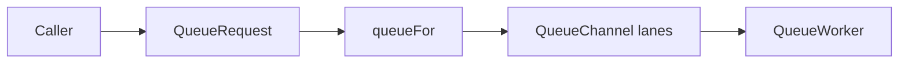

# New queue

Working note for the LoL queue rewrite in `com.safjnest.lol.queue`.
The HTTP API, Discord presentation and persisted documents are unchanged.
This document describes the current code, not the previous steal-based
`DatabaseTracker`.

The class that owns database calculations is still named `DatabaseTracker`.
That name is misleading: the class does not poll or track matches. It is a
compute queue, the sibling of `R4JQueue`. The intended rename is
`ComputeQueue` with route enum `ComputeRoute` (`PROFILE`, `CHAMPION`).
Until that rename lands, this document uses the names that exist in source.

## Why it exists

Two different backends need bounded concurrency:

| Queue | Protects | Route key | Typical work |
| --- | --- | --- | --- |
| `R4JQueue` | Riot rate limits | `LeagueShard` | summoner, rank, mastery, match ids |
| `DatabaseTracker` | Mongo scan/aggregate cost | `PROFILE` / `CHAMPION` | profile stats, champion matrices, builds |

They share machinery (`AbstractQueueScheduler`) and keep separate
registries, workers and in-flight maps. Sharing code does not merge the
two queues.

`Tracker` in `lol.tracker` is a third owner. It still owns match lookup
and match analysis. Do not confuse it with `DatabaseTracker`.

## Pieces

```text
lol/queue/
  QueuePriority          IMMEDIATE, NORMAL, BACKGROUND
  QueueRequest           what a caller submits
  QueueTask              in-flight item + CompletableFuture
  QueueChannel           three priority lanes on one route
  QueueWorker            one virtual thread that drains one channel
  QueueWorkerStatus      snapshot for the tracker Discord command
  AbstractQueueScheduler channels, workers, dedup, shutdown
  R4JQueue               Riot implementation
  DatabaseTracker        compute implementation
  DatabaseWorkerType     PROFILE, CHAMPION
  ChampionMatrixRequest  coalescing for champion stats + pending builds
```

Callers never talk to a worker. They build a `QueueRequest` and call
`R4JQueue.schedule` or `DatabaseTracker.schedule`. The scheduler pushes
onto a `QueueChannel`. The matching `QueueWorker` takes from that channel
and runs the supplier.



## How enqueue works

`AbstractQueueScheduler.enqueue` holds `lifecycleLock` for the whole
decision:

1. If the same `key` is already queued or running, return that future.
   Profile keys may be promoted to a higher priority in the channel where
   the task already sits (`task.queue()`, not `request.route()`).
2. Otherwise `queueFor(request)` chooses the channel.
3. `registerRoute` creates the channel and starts its worker if missing.
4. A `QueueTask` is stored in the in-flight map, assigned to that channel,
   then `channel.offer(task)`.
5. The caller receives `task.future()`. The request thread never runs the
   supplier.

Default `queueFor` is identity: the request route is the channel.
`R4JQueue` uses that default, so EUW work stays on the EUW channel.

`DatabaseTracker` overrides it:

```text
if route is not PROFILE -> always CHAMPION
else if load(CHAMPION) < load(PROFILE) -> CHAMPION
else -> PROFILE
```

Load is `queued count + 1` if that worker is currently executing.
Equal load prefers `PROFILE`, so champion stays free for builds.

The logical route on the request stays `PROFILE` or `CHAMPION`. The
physical channel can differ for profile work. `QueueTask.queue()` is the
physical assignment; it does not change after offer. There is no steal.

## Priorities

`QueueChannel` has three FIFO lanes. `take` always drains
`IMMEDIATE`, then `NORMAL`, then `BACKGROUND`.

| Priority | Meaning in compute queue | Placement |
| --- | --- | --- |
| `IMMEDIATE` | manual profile refresh / owner submit | ahead of NORMAL and BACKGROUND |
| `NORMAL` | user-triggered missing data | after other NORMAL, before BACKGROUND |
| `BACKGROUND` | stale refresh | end of that channel |

`R4JQueue.request` collapses non-background work to `IMMEDIATE`, so Riot
calls are either interactive or explicit background.

A running task is never interrupted. Promote only reorders a queued task
inside its own channel.

## DatabaseTracker topology

Two channels exist from construction: `PROFILE` and `CHAMPION`. Each has
exactly one worker.

- Champion stats matrices, champion builds and the scheduled champion
  refresh always go to `CHAMPION`. They stay serial on that channel.
- Profile statistics, matchups, activity, profile refresh and
  `submit` / `submitManual` / `submitStale` are PROFILE-logical. At insert
  they go to the lighter channel.

Example:

1. First profile job starts on `PROFILE` (tie-break).
2. Second profile job starts on `CHAMPION` (load `0` vs `1`).
3. First build queues on `CHAMPION` behind the running profile job.
4. Second build queues after the first build, still on `CHAMPION`.
5. Third profile job goes to `PROFILE` if that channel still has fewer
   items.

At most two Mongo calculations run at once. Two champion calculations
never run together, because they never leave the champion channel.
A profile job that landed on champion delays later builds on that same
channel; it does not move back to profile when profile becomes idle.

`startChampionData` is three explicit outcomes: nothing (`VOID`),
build-only, or statistics (optionally attaching a build through
`startChampionStatistics`). Recent-patch matrices are still chained
oldest to newest. Duplicate matrix keys coalesce through
`ChampionMatrixRequest`.

## R4JQueue topology

One channel and worker per `LeagueShard`, created on first use.
No least-loaded override, no steal. A slow shard fills only its own
queue.

## What changed versus the previous design

| Before | After |
| --- | --- |
| Nested channel/worker types inside the schedulers | Top-level files in `lol.queue` |
| Duplicated lane loops in Riot and DB queues | One `AbstractQueueScheduler` |
| `ensureChannel` + `computeIfAbsent` side effects | `registerRoute` under the lifecycle lock |
| Enqueue mixed channel lookup and worker counters | Always `channel.offer` |
| Champion worker stole from PROFILE when idle | Assignment only at insert |
| Tasks could start on a channel they were not offered to | Task stays on `task.queue()` |
| Profile work always physically on PROFILE | Profile work may sit on CHAMPION if that channel is lighter |
| Shutdown leaked `ExecutorService` to the scheduler | `requestStop` / `awaitStopped` / `drain` |
| Nested ternaries in `startChampionData` | Linear `VOID` / build / statistics |

Unchanged:

- public HTTP status and payloads (`200`, `202`, `PARTIAL`)
- Discord embeds, field order and tracker command layout
- match lookup / match analysis queues on `Tracker`
- `ProfileService` / `ChampionService` as calculation owners
- dedup keys (`profile-statistics:…`, `champion-stats-matrix:…`, …)
- at most two concurrent database calculations

## Shutdown

`shutdownScheduler`:

1. snapshot workers
2. `requestStop` on each (interrupt the virtual thread)
3. `drain` every channel and cancel remaining futures
4. clear maps
5. `awaitStopped` outside the lock, 30s bound

`DatabaseTracker.shutdown()` and `R4JQueue.shutdown()` are the public
facades. Database shutdown still happens before Mongo close.

## Diagnostics

`DatabaseTracker.workerStatuses()` / scheduler snapshots expose worker
id, type (`profile` / `champion` or shard name), running flag, current
job, queued names, submitted/started/finished counts. The owner `tracker`
command still renders three embeds from that snapshot. Normal queue
lifecycle is not written to the application log.

## How to submit work

```java
R4JQueue.schedule(R4JQueue.request(shard, "summoner", puuid, () -> fetch));

DatabaseTracker.schedule(new QueueRequest<>(
    key,
    readableName,
    DatabaseWorkerType.PROFILE,   // or CHAMPION
    QueuePriority.NORMAL,
    () -> PROFILE_SERVICE.refreshStatistics(...)
));
```

Do not start the supplier on the HTTP thread. Do not add a second in-flight
map. Duplicate keys must share the existing future.

## Tests

- `AbstractQueueSchedulerTest`: lane order, one worker per registered
  route, queued-task cancellation on shutdown
- `QueueTaskTest`: complete, fail, promote, cancel
- `R4JQueueTest`: Riot facade
- `DatabaseTrackerTest`: still lives under `lol.tracker` and still uses
  the old steal-oriented names in a few cases; placement tests for
  least-loaded insert are the remaining verification gap

## Follow-up

1. Rename `DatabaseTracker` → `ComputeQueue` and
   `DatabaseWorkerType` → `ComputeRoute`.
2. Move `DatabaseTrackerTest` to `src/test/java/com/safjnest/lol/queue/`
   and assert insert-time placement (no jump after offer).
3. ADR-0010, macro-task 0003/0007 and the queue-related audits were
   amended 2026-08-20 to match insert-time routing.
